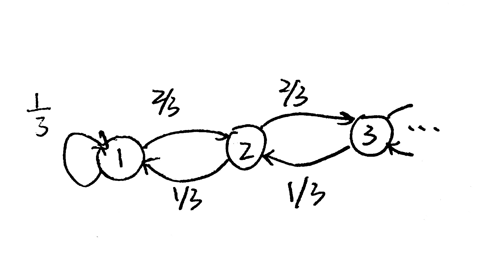

# Chapter 1 Markov Chains

## Lec 1

###Gambler's Ruin

> $$
> w_i = 1, p = \left\{
> \begin{aligned}
> 1&, &p \\
> -1&, &1-p = q 
> \end{aligned}
> \right.
> $$
>
> $x_0$ initial wealth
>
> $x_n = x_0 + w_1 + ... + w_n$
>
> $x_n - x_0$ accumulated winnings
>
> Question: For A, B> 0, what is *prob* of winning A before losing B?

Let $\tau = \min\{n\geq 0: x_n = A, ~or~ x_n = -B\}$, $\tau$ is a random time. For this setup $\tau$ is finite <b>(prove later)</b>

$x_{\tau} = A ~or~ -B$

How to analyze $f(k) = P(x_{\tau}=A|x_0 = k)$ for $k =\in\{-B, ..., A\}$

$f(-B) = 0$ and $f(A) = 1$.

FIrst step analysis: $ k =\in\{-B+1, ..., A-1\}$, 

$ f(k)= P(x_{\tau}=A|x_0 = k) $

$= P(x_{\tau}=A, x_1 = k+1|x_0 = k)  + P(x_{\tau}=A, x_1 = k-1|x_0 = k)$

$= P(x_{\tau}=A| x_1 = k+1, x_0 = k) P(x_1 = k+1|x_0 = k) + P(x_{\tau}=A|x_1 = k-1, x_0 = k)P(x_1 = k-1|x_0 = k)$

$=f(k+1)p + f(k-1)q$

(Example 1.43, Durrett)

$f(k) = (p+q)f(k) = f(k+1)p + f(k-1)q$

$p(x_{\tau}=A|x_0 = 0) = \frac{(q/p)^B - 1}{(q/p)^{A+B}-1} ~ (p\neq q)$

$p(x_{\tau}=A|x_0 = 0) = \frac{B}{A+B} ~ (p = q)$

> Why is it called gambler's ruin?

For different $p$: 

|                    p                     | 0.5  | 0.495  | 0.47              |
| :--------------------------------------: | ---- | ------ | ----------------- |
| chance with win \$100 before lose ​\$ 100 | 0.5  | 0.1191 | $6\times 10^{-6}$ |

### Definition of Markov Chain

Let $x_n, n = 0 , 1... $ be a discrete time Markov chain with transition matrix $p(i,j)$

​				$$P(x_{n+1}=j|x_n = i, x_{n-1} = i_{n-1},...) = P(x_{n+1}=j|x_n = i) = p(i,j)$$

Write out transition matrix for gambler ruin $N=5, p=0.4$: 

## Let 2

###Higher order

Transition probabilities

> Given initial distribution and transition matrix $P$
>
> What is prob that MC will be in state $i$ at $n \geq 0$.

n-step transition: $p^n_{ij}$ is the prob of moving from $i$ to $j$ in $n$ steps.
$$
p^n_{ij} = P(x_n=j|x_0=i)  = P(x_{n+k}=j|x_k=i)
$$
path counting $\rightarrow$ linear algebra: $p_{ij}^n$ is the $(i,j)$ entry of $p^n$.

**Proposition**: for all $n\geq 0$ and $i,j\in S$, $p^n_{i,j} = P(x_n=j|x_0=i)=P_{ij}^n$ 

Check $n = 0$ case. $P^0 = I$. (The identity matrix).

$n = 1$, true by definition.

By induction, if $P(x_n=j|x_0=i) = P^n$, 
$$
\begin{aligned}
P(x_{n+1}=j|x_0=i) &= \sum_{k\in S}P((x_{n+1}=j, x_n=k)|x_0=i) \\
&= \sum_{k\in S}\frac{P(x_{n+1}, x_n=k, x_0=i))}{P(x_0=i)}\\
&= \sum_{k\in S}\frac{P(x_{n+1}, x_n=k, x_0=i))/P(x_0=i)}{P(x_n=k,x_0=i)/P(x_0=i)}\frac{P(x_n=k,x_0=i)}{P(x_0=i)} \\
&= \sum_{k\in S}P(x_{n+1}=j|x_n=k, x_0=i)P(x_n=k|x_0=i) \\
&= \sum_{k\in S}P_{kj}P^n_{ik} \\
&= P_{ij}^{n+1}
\end{aligned}
$$

### Chapman-Kolmogorov Equations

$$
P^{m+n}_{i,j} = \sum_{k\in S}p^m(i,k)p^n(k,j)
$$

*Proof*
$$
\begin{aligned}
P^{m+n}_{i,j} &= \sum_{k\in S} P((x_{m+n}=j, x_n = k) |x_0=i) \\
&= \sum_{k\in S} P(x_{m+n}=j|x_n=k, x_0=i)P(x_n=k|x_0=i) \\
&= P_{kj}^mP_{ik}^n
\end{aligned}
$$
By induction again, is the same as above.

## Lec 3 

$x_0$ initial wealth

$x_n = x_0 + w_1 + w_2 + ... + w_n$
$$
w_i = 1, p = \left\{\begin{aligned}1&, &p=\frac{1}{2} \\-1&, &1-p = \frac{1}{2} \end{aligned}\right.
$$
​				

$\{x_0, w_1 ... w_n\}$ independent set of ruins.

$\mathbb{P}(x_{n+1}=j|x_n=i, ... x_0=i_0) = \mathbb{P}(x_{n+1}=j|x_n=i)$

What makes it a M.C.?

Based on the facts that (1) independent: can multiply probabilities; (2) functions of subsets of independent variables are also independent,
$$
\begin{align}
\mathbb{P}(x_n=j|x_1=i, x_0=i_0) &= \frac{\mathbb{P}(x_n=j, x_1=i, x_0=i_0)}{\mathbb{P}(x_1=i, x_0=i_0)} \\
&= \frac{\mathbb{P}(x_0+w_1+...+w_n=j, x_0+w_1=i, x_0=i_0)}{\mathbb{P}(w_1=i-i_0, x_0=i_0)} \\
&= \frac{\mathbb{P}(i_0+i-i_0+w_2...+w_n=j, w_1=i-i_0, x_0=i_0)}{\mathbb{P}(w_1=i-i_0)\mathbb{P}(x_0=i_0)} \\
&= \frac{\mathbb{P}(i+w_2...+w_n=j)\mathbb{P}(x_1=i)}{\mathbb{P}(x_1=i)}~~~~~~~~~~~~~~~~ \text{due to independency} \\\
&= \frac{\mathbb{P}(i+w_2...+w_n=j, x_1=i)}{\mathbb{P}(x_1=i)} \\
&= \mathbb{P}(x_n=j| x_1=i)
\end{align}
$$

> Example:
>
> Consider a MC on $S=\{1,2\}$, with transition matrix
> $$
> p = \left[\begin{aligned} 2/3, 1/3 \\ 1/8, 7/8\end{aligned}\right]
> $$
> and initial distributor $\alpha = (1, 0)$.
>
> > $P(x_4=1) \approx 0.33533 < 1/2$
> >
> > if  $\alpha = (1/2, 1/2)$, $P(x_4=1)< 0.33533 $.

For large $n$, what are the values of $P(x_n=i)$ for some $i \in S$ ?

Does it depends on initial distribution $\alpha$ ? No, after a lont time, stabilize.

> $$
> n \rightarrow \infty, p^n \approx \left[\begin{aligned} 3/11, 8/11 \\ 3/11, 8/11\end{aligned}\right] = \Pi
> $$

**Stationary or invariant distribution**:

- does every process have a stationary distribution?
- if so, is it unique? (*The answer is Sometimes*)
- can we say how long it takes to stablize?

## Lec 4

###Classification of states

Notation:

$\mathbb{P}_x(A) := \mathbb{P}(A|X_0 = x)$, similarly, $\mathbb{E}_x$ represents expected value with inital state at $x$.

Let $T_y := \min\{n\geq1: X_n = y\}$ which means $T$ is the first time $X$ returns to state $y$, and $n=0$ doesn't count, because the initial state is at $y$.

A **hitting time** (or **first hit time**) is the first time at which a given process "hits" a given subset of the state space. **Exit times** and **return times** are also examples of hitting times.

Let $\rho_{yy} = \mathbb{P}_y(T_y<\infty)$ which is the probability of returning to $y$

*eg*: For the transition probabilities as below, 

 

We have $\frac{1}{3} < \rho_{11} < 1$.

$\rho_{yy} = 1$ recurrent

$\rho_{yy} <1$ transient

> A state is recurent if $\rho_{yy} = 1$ and transient if $\rho_{yy} < 1$.

For the following formula, 
$$
\begin{aligned}
T^1_y &= ~ T_y \\
T^k_y &=  \left\{\begin{aligned} & \min\{n>T_y^{k-1}: X_n = y\},~~~ &if ~~ T_y^{k-1}<\infty \\
	& ~\infty, ~~~~&if~~ T_y^{k-1}=\infty
	\end{aligned}\right.
\end{aligned}
$$

1. can you describe $T^k_y$ in words? 

   *The kth time return to state y*.

2. is the chance that $T^k_y=\infty$ entirely from the 2nd case?

    *No*.

> For a random outcome:
>
> |   t   |  0   |  1   |  2   |  3   |  4   |  5   |  6   |  7   | ...  | never get back to 1 |
> | :---: | :--: | :--: | :--: | :--: | :--: | :--: | :--: | :--: | :--: | :-----------------: |
> | state |  1   |  2   |  1   |  2   |  1   |  2   |  3   |  4   | ...  |                     |

In this case, $T_1^1 = 2$, $T_1^2 = 4$, $T_1^3 = \infty$.  (Back to Q2: not all $T^k_y=\infty$ comes from the 2nd case)
$$
\begin{aligned}
\mathbb{P}(T^2_y < \infty) &= \mathbb{P}(T^2_y<\infty, T^1_y<\infty) &[1]\\
&= \mathbb{P}(T^2_y<\infty| T^1_y<\infty) \mathbb{P}(T^1_y<\infty) &[2] \\
&= \rho_{yy} \cdot \rho_{yy}\\
&= \rho_{yy}^2
\end{aligned}
$$
For [1], the RHS is equal to LHS because $T^2_y < \infty$ implies that there must satisfy $T^1_y < \infty$.

For [2], $\mathbb{P}(T^1_y<\infty) = \rho_{yy}$ and $\mathbb{P}(T^1_y<\infty)$ means for some $k$, $X_k = y$. Under the condition, the first part of [2] is the same as $T^1_y<\infty$, thus yield the next derivation.

> **Fact**: $\mathbb{P}(T^k_y<\infty) = \rho^k_{yy}$

Transient case: if $\rho_{yy} < 1$, $\mathbb{P}_y(T^k_y<\infty~for~all~k) \leq \mathbb{P}_y(T^L_y < \infty)$ for some fixed $L$. Since $\rho^L_{yy}\rightarrow 0$, it must be that $\mathbb{P}_y(T^k_y<\infty~for~all~k) = 0$. Therefore, eventually at some time, it will not return to initial state.

###Strong Markov Property

**Definition** 

$T$ is a **stopping time** if the occurrence (or nonoccurrence) of the event “we stop at time n,” $\{T = n\}$,
can be determined by looking at the values of the process up to that time: $X_0$, ..., $X_n$. To see that $T_y$ is a stopping time, $\{T_y = n\} = \{X_1 \neq y, ..., X_{n−1}  \neq y, X_n = y\}$

**Theorem: Strong Markov property**

Suppose $T$ is a stopping time. Given that $T = n$ and $X_T = y$, any other information about $X_0, ... X_T$ is
irrelevant for predicting the future (computing probabilities), and $X_{T+k}, k \geq 0$ behaves like the Markov chain with initial state $y$.

> eg. Gambler's ruin on $\{0, 1, 2, 3, 4\}$:
>
> 
>
> 1. list any recurrent state: 
>
>    *0, 4*
>
> 2. if transient states, try to bound $\rho_{yy}$.
>
>    $0.24 < \rho_{11} = \mathbb{P}_1(T^1_1 < \infty) < 0.4$
>
>    > Where does *0.4* come? $\Rightarrow$ It is because $ \mathbb{P}_1(T^1_1 = \infty)$ > 0.6
>
> For $\rho_{22}$, the lower bound is easy. However, the upper bound can be restricted or lessened in different degrees, for example, $\mathbb{P}_2(T^1_2 = \infty) > 0.6\times0.6 + 0.4\times 0.4 ...$

### communicate

$X$ **communicates** with $y$： $X \rightarrow y$ if there is a positive probability of reaching $y$ when starting at $X$.
$$
\rho_{xy} = \mathbb{P}_x(T_y<\infty) > 0
$$

> Suppose transition matrix $p^m(x, y)=0, \forall m \geq 0$.
>
> $\rho_{xy}=\mathbb{P}_x(T_y<\infty) = \mathbb{P}(\cup_{m=1}^\infty\{T_y=m\} )= \sum_{m=1}^\infty\mathbb{P}_x(T_y=m) \leq \sum_{m=1}^\infty p^m(x,y)= 0$, which contradicts the fact that $\rho_{xy} > 0$. 
>
> So $x \rightarrow y$ implies $p^m(x, y)>0$ for some $m\geq 0$.

## Lec 5

$X$ communicates with $y$ means that $\rho_{xy} = \mathbb{P}_x(T_y < \infty)>0$, and that $p^m(x,y)>0$ for some $m\geq1$.

### Theorems about communication

**Lemma**

If $x\rightarrow y$ and $y\rightarrow z$ then $x\rightarrow z$.

> *proof*:
>
> exists $m$, $p^m(x,y)>0$
>
> exists $n$, $p^n(y,z)>0$
>
> Using Chapman Kolmoborov, 
> $$
> p^{m+n}(x,z) = \sum_{k\in S}p^m(x,k)p^n(k,z) \geq p^m(x,y)p^n(y,z)
> $$
> $k$ is an arbitrary state, so we can fix $m$ and $n$.

**Theorem**

If $x\rightarrow y$, $\rho_{xy}>0$. But if $\rho_{yx} < 1$, then the chance that state $y$ do not return back to $x$ is positive. Then $x$ is transient.

> *proof*:
>
> construct a path start at $x$, 
> $$
> x = y_1, y_2, ... y_k = y
> $$
> where $\mathbb{P}(y_i, y_{i+1})>0$. Then,
>
> $\mathbb{P}_x(T_x = \infty)) \geq p(x,y_2)p(y_2,y_3)...p(y_{k-1}, y_k)(1-\rho_{yx}) > 0$. $\rho_{yx}$ means the probability that traverse from state $y$ to $x$.

**Corollary**

> If $x$ is recurrent and $\rho_{xy}>0$, then $\rho_{yx}=1$. 

### Definition of set of states

- Set $A\subset S$ is **closed** if the chain cannot leave $A$.

  $p(i,j) = 0$ if $i\in A$ and $j\notin A$.

- Set $B\subset S$ is **irreducible** if whenever $i,j\in B$, $i \rightarrow j$.

*eg.* For the following case,

- closed: \{0,1,2,3,4\}, \{0,4\}, \{0\}, \{4\}, $\emptyset$.
- irreducible: all subsets of \{1,2,3\}

### Chain state properties

**Theorem**

If $C$ is a finite, closed, irreducible set, then all states in $C$ are recurrent.

However, given an infinite chain, the class of all states depends on their transition probabilities.

For example, in this picture, there is only one closed set (the whole chain).

If $p>\frac{1}{2}$, the chain has larger probability wander off the origin to infinity and never be back. In this case, all states are transient (since 1 is transient, and by induction 2 is transient, and in turn, all states are).

If $p\leq \frac{1}{2}$, states have a larger probability to return to 1, and 1 will be recurent. Then by induction, 2 is recurrent, and in turn, all states are recurrent.

> In fact, if $x$ is recurrent and $x\rightarrow y$, then $y$ is also recurrent.

### Decomposition Theorem

If $S$ is finite, then
$$
S = T \cup R_1 \cup R_2\cup...\cup R_k
$$
where $T$ is the set of transient states, and $R_i$ are finite, closed, irreducible sets of recurrent states.

> *proof*:
>
> Let $T$ be all states $x$ that have a $y$ with $x\rightarrow y$, $y\nrightarrow x$.
>
> For $x\in S - T$, define 
> $$
> Cx: \{y: x\rightarrow y\}
> $$
> It is irreducible and closed. Because $x\in S - T$, so if  $x\rightarrow y$, $y\rightarrow x$. And for all $y,z\in Cx$, if $y\rightarrow x$, $x\rightarrow z$, then $y\rightarrow z$.
>
> If all states are used, done; else find $Cx_2 \subset S - T - Cx$.

## Lec 6

### Determine reccurenct state

**Theorem**

If $C$ is finite, closed, irreducible then all states in $C$ are recurrent.

**Lemma**

1. If $x$ is recurrent and $x\rightarrow y$, $y$ is recurrent.

2. In a finite, closed set, there is a recurrent state.

Recall that
$$
\begin{aligned}
& T_y^k = \min\{n>T_y^{k-1}:X_n = y\} \\
& \rho_{xy} = \mathbb{P}_x(T_y < \infty) \\
& \mathbb{P}_x(T^k_y < \infty) = \rho_{xy}\rho^{k-1}_{yy}
\end{aligned}
$$
Induction and strong Markov property.

New idea: let $N(y)$ be the total number of visits to $y$. If $\rho_{xy} >0$, statr at $x$, then:

- If $y$ recurrent, $E_x[N(y)] = \infty$. ("average" time of reaching $y$)
- If $y$ transient, $E_x[N(y)]$ is finite.

> *proof*
>
> Fact: if $x$ is a non-negative integer, 
> $$
> E(x) = \sum_{n=0}^{\infty}n\mathbb{P}(x=n) = \sum_{k=0}^{\infty}\mathbb{P}(x\geq k) \\
> $$
> This is because $\mathbb{P}(x=n)$ appears $n$ times.
> $$
> \begin{aligned}
> E(x)[N(y)] &= \sum_{k=1}^{\infty}\mathbb{P}_x(N(y)\geq k)\\
> 	&= \sum_{k=1}^{\infty}\mathbb{P}_x(T^k_y < \infty)\\
> 	&= \sum_{k=1}^{\infty}\rho_{xy}\rho^{k-1}_{yy}
> \end{aligned}
> $$
> 

Therefore, 

If $\rho_{yy}=1$,  $E(x)[N(y)] = \infty$. 

If $\rho_{yy} < 1$, 
$$
E(x)[N(y)] = \rho_{xy}\frac{1}{1-\rho_{yy}} = \frac{\rho_{xy}}{1-\rho_{yy}}
$$
**Theorem**

$y$ is recurrent if and only if $\sum_{n=1}^{\infty}p^n(y,y) = E_x[N(y)] = \infty$.

> First of all, notice that
> $$
> N(y) = \sum_{n=1}^\infty\mathbb{1}\{x_n = y\}
> $$
> Therefore, 
> $$
> \begin{aligned}
> E_x[N(y)] &= E_x\left(\sum_{n=1}^\infty\mathbb{1}\{x_n=y\}\right) \\
> 	&= \sum_{n=1}^\infty\mathbb{P}_x(x_n=y)~~~~~~~~~\text{expectation at each step is the probability in state $y$ at step $n$}\\
> 	&= \sum_{n=1}^\infty p^n(x,y) ~~~~~~~~~~~\text{$p^n(x,y)$ means $x\rightarrow y$ in $n$ steps, regardless of intermidiate steps}
> \end{aligned}
> $$

**proof of lemma 1**: If $x$ is recurrent and $x\rightarrow y$, $y$ is recurrent.

> Since $x\rightarrow y$, $\rho_{xy}>0$. If $x$ is recurent, $\rho_{yx} = 1$.
>
> If $\rho_{xy}>0$ then exists $j\geq 1$, $p^j(x,y)>0$.
>
> If $\rho_{yx}>0$, then exists $l\geq 1$, $p^l(x,y)>0$.
> $$
> \begin{aligned}
> \sum_{n=1}^\infty p^n(y,y) &\geq \sum_{k=0}^\infty p^{j+k+l}p(y,y)    ~~~~~~~~~~~~~~~~~~~~~~~~~~~~~\text{which is at least $n \geq j+l$ steps}\\
> & \geq \sum_{k=0}^\infty p^l(y,x)p^k(x,x)p^j(x,y) \\
> &= p^l(y,x) \left(  \sum_{k=0}^\infty p^k(x,x)\right) p^j(x,y)  ~~~~\text{the middle sum is infinite because $x$ is recurrent}\\
> &= \infty  ~~~~~~~~~~~~~~~~~~~~~~~~~~~~~~~~~~~~~~~~\text{therefore $y$ is recurrent according to the theorem above}\\
> \end{aligned}
> $$
> 

#### Hints on HW2, Q6

> 1. Stiring's approximation:
>
>    $\sqrt{2\pi n}\left(\frac{n}{e}\right)^n \leq n! \leq e\sqrt{n}\left(\frac{n}{e}\right)^n$
>
>    The two terms only differs in constant (of same complexity).
>
> 2. \#path from 0 to self?
>    Must half +1, half -1.

## Lec 7

**lemma**

In a *closed, finite* set there is a recurrent state.

> *proof*
>
> Recall $N(y)$: \# of visits to state $y$. So all states transient implies $E_x[N(y)] < \infty$.
>
> Therefore, $\sum_{y\in C}E_x[N(y)] = \sum_{y\in C}\sum_{n=1}^\infty p^n(x,y) < \infty$. Since
> $$
> \sum_{y\in C}\sum_{n=1}^\infty p^n(x,y) = \sum_{n=1}^\infty \sum_{y\in C}p^n(x,y) 
> $$
> but $\sum_{n=1}^\infty\sum_{y\in C} p^n(x,y) = \sum_{n=1}^\infty 1 = \infty$, there is a contraditcion. Therefore, there is a recurrent state.

###Stationary distribution

**Definition**

On a discrete time Markov chain,  on infinite or finite $S$, $\Pi$ is a **stationary measure** (non-negative, $\Pi\geq 0$) if $\pi(x) = \sum_{y\in S}\pi(y) p(y,x)$ for all $x\in S$.

$\pi(y)$ represents each pile, and $p(y,x)$ is proportion of item moving from $y$ to $x$. **All** piles stay the same after one step.

A stationary measure is called a **stationary distribution** if $\sum_{x\in S}\pi(x) = 1$.

To solve the problem, using the equations
$$
\Pi \cdot P = \Pi \\
\sum_i\pi_i = 1
$$
**Theorem**

Suppose a finite, discrete time Markov chain has a $k\times k$ transition matrix $P$, and the chain is irreducible (all states comunicates one another). 

Then, there is a unique solution to $\Pi \cdot P = \Pi$ with $\sum_x\pi(x) = 1$ and $\pi_x > 0$.

* irreducible indicates $\pi_x > 0$, because if some $\pi_x = 0$, it cannot communicate to other state.

> *proof*
>
> If $\Pi \cdot P = \Pi$, then it means $\Pi \cdot (P - I) = 0$. We can know that $P - I$ has many properties:
>
> - non-trivial null space
>   - In linear algebra, the null space of a matrix $x$ is also known as kernel. And $v$ is called zero vector of the space: $\operatorname { ker } ( L ) = \{ \mathbf { v } \in V | L ( \mathbf { v } ) = \mathbf { 0 } \}$.
> - not injective
>   - a function is injective, if $𝑓(𝑥)=𝑓(𝑦) \Rightarrow 𝑥=𝑦$. A linear function which is injective always have trivial null space. In general a linear function is injective if it's columns are linear indepedent.
> - 0 is an eigenvalue
> - singular matrix
>
> This is because the row sum of $P$ is 1, and so is $I$. Therefore, as below,  
> $$
> (P - I)\left[\begin{array}{c}1\\
> \vdots\\
> 1\end{array}\right] = \left[\begin{array}{c}0\\
> \vdots\\
> 0\end{array}\right]
> $$
> The rank of $P$ is not full.
>
> So exists $v$ with $v(P-I)=0$. 
>
> **positivity**:
>
> Think about entries of $P^{k-1}$. Since the set is irreducible,  the worst case shortest path $x\rightarrow y$ needs $k-1$ steps. Therefore, all entries of $P^{k-1}$ must be positive. However, this is just *morraly* correct, but not factually correct, as there might exists *periodicity*.
>
> 
>
> For example, in this case the period of state 1 is two.
>
> To fix it by being lazy, we can add a loop at each state, then we can ensure that $p^{k-1}(x,y)>0$.
>
> **uniqueness**:
> Let $v$, $w$ be different solutions. Then,
> $$
> v(P-I) = 0, ~~w(P-I)=0 \\
> (v-w) \neq 0~~\text{is a solution} \\
> (v-w)(P-I) = 0
> $$
> However, since $v\neq w$, there must exists terms in $v$ greater than $w$ and vice versa, because their term sums are both 1. This contradict positivity. Therefore, there can only exists a unique solution.

## Lec 8

###Periodity

If $y$ is transient, $p^n(x,y)\rightarrow 0$. Recall  
$$
\sum_{n=1}^\infty p^n(y,y) = \left\{\begin{aligned}&\infty & ~~~\text{if recurrent}\\
& \text{finite}& ~~~\text{if transient}\end{aligned}\right.
$$
Limits for $p^n(x,x)$ may not exist if there is periodicity.

**Definition**

Let $I_x = \{n: p^n(x,x)>0\}$. The period of $x$ is GCD of $I_x$. 

*Fact*: if $x$ has period 1, then there is an $n_0$ such that for all $n\geq n_0$, there is $n\in I_x$.

*Lemma*: $I_x$ is closed under addition. That is, if $i,j \in I_x$, then $i + j \in I_x$. 

​	Proof: If $i,j \in I_x$ then $p_i(x,x) > 0$ and $p_j(x,x) > 0$ so 
$$
p ^ { i + j } ( x , x ) \geq p ^ { i } ( x , x ) p ^ { j } ( x , x ) > 0
$$
​	Hence $i+j\in I_x$.

**Lemma**

If $\rho_{xy}>0$, $\rho_{yx}>0$ then $x$ period = $y$ period.

> *proof*: Suppose that the period of $x$ is $c$, while the period of $y$ is $d < c$. Let $k$ be such that $p^k(x,y) > 0$ and let m be such that $p^m(y,x) > 0$. Since 
> $$
> p^{k+m}(x, x) \geq p^k(x, y)p^m(y, x) > 0
> $$
> 
>
>  we have $k+m\in I_x$. Since $x$ has period $c$, $k+m$ must be a multiple of $c$. Now  let l be any integer with $p^l(y, y) > 0$. Since
> $$
>  p^{k+l+m}(x, x) \geq p^k(x, y)p^l(y, y)p^m(y, x) > 0 
> $$
> 
>
> $k+l+m\in I_x$, and $k+l+m$ must be a multiple of $c$. Since $k+m$is itself a multiple of $c$, this means that $l$ is a multiple of $c$. Since $ l \in I_y$ was arbitrary, we have shown that $c$ is a divisor of every element of $I_y$, but $d < c$ is the greatest common divisor, so we have a contradiction. 

Now let's first denote the key words with abbreviation as follow:

- I: MC is irreducible
- A: MC is aperiodic
- R: all states are recurrent
- S: there is a stationary distribution.

### Limit behavior

#### Convergence theorem

Suppose a Markov chain is irreducible, aperiodic and exists a stationary distribution, then as $n\rightarrow \infty$, $p^n(x,y) \rightarrow \pi(y)$.

If missing irreducible, then exists $p^n(x,y)=0$ which is contradict to $\pi(y)>0$.

**Theorem**

Suppose I and R, then there is a stationary measure with $\mu(x)>0$ for all $x$. 

>  If $\sum_x\mu(x)=\infty$, then it cannot be rescaled to a stationary distribution.

#### Asymptotic frequency

> It describes the limiting fraction of time spent in each state.

Suppose irreducible and  all states are recurrent. Define the random variable $T_y=\min\{n\geq 1: X_n =y\}$ (which is the hitting time). Also define the random variable $N_n(y)$ as \# of visits to $y$ up to time $n$. Apparently, $0\leq N_n(y)\leq n$.
$$
\frac{N_n(y)}{n} \rightarrow \frac{1}{E[T_y]}
$$
The LHS can be intepreted as  proportion of time at state $y$ in $n$ times, and the RHS represents average proportion of time at state $y$.

**Theorem**

If a Markov chain is irreducible and exists a stationary distribution, then
$$
\pi(y) = \frac{1}{E[T_y]}
$$
Therefore the stationary distribution is unique

If $E[T_y]<\infty$, then it guarantees $y$ is recurrent. This type of recurrency is called **positive recurrent**.

If $y$ is recurrent and $E_y[T_y] = \infty$, then $y$ is **null recurrent**: the return to $y$ will be very slow.

## Lec 9

**Theorem**

Suppose a Markov chain is irreducible and recurrent ($\mathbb{P}_x(T_x<\infty) = 1$). 

Let $x\in S$ and $T_x = \min\{n\geq 1, x_n = x\}$.  Define 
$$
\mu_x(y) = \sum_{n=0}^\infty \mathbb{P}_x(x_n=y, T_x > n)
$$
$\mathbb{P}_x(x_n=y, T_x > n)$ means the probabilty of visit state $y$ before returning to $x$ in time $\{0, 1, ...T-1\}$.

Therefore, the sum means the *expected number of visits* to $y$ before returning to $x$.

$\mu_x$ defines a stationary measure with $0<\mu_x(y)<\infty$.

> It cannot be 0, because the chain is irreducible. Before returning to $x$, it must have positive probability from $x$ to $y$.
> $$
> \mu_x(x) = \sum_{n=0}^\infty\mathbb{P}_x(x_n=x, T_x>n) = 1
> $$
> If $n>0$ the situation is empty, so probability is 0, and $n=0$ the probability is 1.

*proof*

First, using the Markov property, we know that
$$
\begin{aligned}
\mathbb{P}_x(x_n=y, T_x>n, x_{n+1}=z) &= \mathbb{P}(x_{n+1}=z|x_n=y, T_x>n)\\

&= \mathbb{P}(y,z)\mathbb{P}(x_n=y, T_x>n)
\end{aligned}
$$
Using the definition of $\mu_x(y)$ above, 
$$
\begin{aligned}
\sum_y\mu_x(y)p(y,z) &= \sum_y\left(\sum_{n=0}^\infty\mathbb{P}_x(x_n=y, T_x>n)\right)p(y,z) \\
&= \sum_y\sum_{n=0}^\infty\mathbb{P}_x(x_n = y, T_x>n, x_{n+1}=z)\\
&= \sum_{n=0}^\infty\sum_y\mathbb{P}_x(x_n=y, T_x>n, x_{n+1} = z)\\
&= \sum_{n=0}^\infty\mathbb{P}_x(T_x>n, x_{n+1} = z)
\end{aligned}
$$
Case 1: if $x\neq z$ and $x_{n+1}=z$, then it must satisfies that $T_x>n+1$.
$$
\begin{aligned}
\sum_{n=0}^\infty\mathbb{P}_x(T_x>n, x_{n+1} = z) &= \sum_{n=0}^\infty\mathbb{P}_x(T_x>n+1, x_{n+1} = z)\\
&= - \mathbb{P}_x(T_x>0, x_0 = z) + \mu_x(z)\\
&= \mu_x(z)
\end{aligned}
$$
Case 2: if $x=z$, 
$$
\begin{aligned}
\sum_{n=0}^\infty\mathbb{P}_x(T_x>n, x_{n+1} = z) &= \sum_{n=0}^\infty\mathbb{P}_x(T_x>n, x_{n+1} = x)\\
&= \sum_{n=0}^\infty \mathbb{P}_x(T_x = n+1) ~~~~~\text{since $x$ is recurrent, this must eventually occur}\\
&= 1 = \mu_x(x)
\end{aligned}
$$

**Theorem**

If a Markov Chain is irreducible and a stationary distribution exists, then
$$
\pi(x) = \frac{1}{E_x[T_x]}
$$
Further, if it is positive recurrent, $\frac{1}{E_x[T_x]} < \infty$.

### Three equivalent situations

For an irreducible Markov Chain, the following are equivalent:

1. some state are positive recurrent
2. there is a stationary distribution
3. all states are positive recurrent

> *proof*: we know that $2\rightarrow 3$ and $3\rightarrow 1$. To prove $1\rightarrow 2$, suppose $x$ is a recurrent state.
> $$
> \begin{aligned}
> \sum_y\mu_x(y) &= \sum_y \sum_{n=0}^\infty \mathbb{P}_x(x_n = y, T_x>n) \\
> &= \sum_{n=0}^\infty \sum_y \mathbb{P}_x(x_n = y, T_x>n) \\
> &= \sum_{n=0}^\infty \mathbb{P}_x(T_x>n) \\
> &= E_x(T_x) < \infty
> \end{aligned}
> $$
>
> $$
> \text{Mass at }~~\frac{\mu_x(x)}{E_xT_x} = \frac{1}{E_xT_x}
> $$

## Lec 10

### Limit situation and stationary distribution

Suppose a Markov chain is irreducible, aperiodic and has a stationary distribution, then $p^n(x,y) \rightarrow \pi(y)$.

> proof main idea: coupling method
>
> Suppose $S$ is state space $X_n$, build new Markov chain $Z_n$ on $S\times S$. $Y_n$ is a copy of $X_n$ (same $P$).
>
> Since $X_n$ and $Y_n$ are independent, 
> $$
> P((x_1, y_1), (x_2, y_2)) = p(x_1, y_1)p(x_2, y_2)
> $$
> Fact: 
>
> 1. $Z_n$ is irreducible since $X_n$ and $Y_n$ are irreducible. 
> 2. $Z_n$ is positive recurrent, and it has a stationary distribution.
>
> The condition **aperiodic** is very important for $Z_n$ to be irreducible, as can be seen from the following picture: 
>
> 

To check that $\Pi(x_1, y_1) = \Pi(x_1)\Pi(y_1)$ is a stationary distribution, need to satisfy:

1. sum = 1
   $$
   \begin{aligned}
   \sum_{x,y}p((x_2,y_2), (x_1, y_1))\pi(x_2,y_2) &= \sum_{x_2\in S}\sum_{y_2\in S}p(x_2,x_1)p(y_2, y_1)\pi(x_2)\pi(y_2)\\
   &= \sum_{x_2\in S}p(x_2,x_1)\pi(x_2)\sum_{y_2\in S}p(y_2, y_1)\pi(y_2)\\
   &= \pi(x_1)\pi(y_1)
   \end{aligned}
   $$

2. staitionary

Let $T=\min\{n\geq 0;x_n = y_n\}. ($$T$ is a random variable depends on $X_0$, $Y_0$ and the transition matrix, and is also a stopping time.)
$$
\begin{aligned}
\mathbb{P}(x_n = y, T\leq n) &= \sum_{m=0}^n\sum_{x\in S}\mathbb{P}(T=m, x_m = x, x_n=y)\\
&= \sum_{m=0}^n\sum_{x\in S}\mathbb{P}(x_n=y|T=m, x_m = x)\mathbb{P}(T=m, x_m = x)
\end{aligned}
$$
Whether $T=m$ doesn't affect $x_n = y$, therefore, according to Markov property and using *symmetry*, 
$$
\begin{aligned}
~~~~~~~~~~~~~~~~~~~~~~~~~~~~~~~ &= \sum_{m=0}^n\sum_{x\in S}\mathbb{P}(x_n=y|x_m = x)\mathbb{P}(T=m, x_m = x)\\
&=  \sum_{m=0}^n\sum_{x\in S}\mathbb{P}(y_n=y|y_m = x)\mathbb{P}(T=m, y_m = x)\\
&= \mathbb{P}(y_n=y,T\leq n)
\end{aligned}
$$

>  What if $T\rightarrow \infty$? What's $\mathbb{P}(T=\infty)$? Impossible.
>
> Let $V_{xx} = \min\{n\geq 0, x_n = y_n = x\}$, we know that $T\leq V_{xx}$. And $\mathbb{P}(V_{xx}<\infty)=1$ by irreducible.

Final idea: start $x$ at whatever point $x_0$, start $y$ at stationary $\pi$. Then after $T$, $x$ and $y$ will have same distribution according to $\pi$.

## Lec 11

### Question: does a stationary distribition exist?

Does a stationary distribution exists for the following:

Solving $\pi P = \pi$, we have $\pi = [2/5, 1/10, 3/10, 1/5]$.

Does $p^n(x,y) \rightarrow \pi(y)$? (Does the chain converges to equilibrium.)

> No. Paths of positive probabilities are periodic. For example, from $1\rightarrow 1$, $\{2,4,6,…\}$. The period is 2.

Demonstrate values $x$, $y$ so that $p^n(x, y) \nrightarrow \pi(x,y)$.

> $p^{2n+1}(1,1) = 0$.

Find all staionary distribution of:

- Is this chain aperiodic? 
  *yes*.
- What does this imply? 
  *It has infinitely many distributions*.
- Does $p^n(x,y)\rightarrow \pi(y)$?
  **NO**. Some states canot communicate with each other, even if $\pi(y)$ is not specified. 
- Does $p^n(x,y)\rightarrow \pi(y)$ converge to anything?
  For  example, $p^n(3,2) \rightarrow 0$, $p^n(3,3) = 1$.

$p^n(x,y)$ has no well-defined equilibrium.

### Doubly Stochastic Markov Chain

**Definition**: A Markov Chain is doubly stochastic if rows sum to 1 and columns sum to 1.

**Theroem**

If Markov Chain is doubly stochastic, with $n$ states (finite), then $\frac{1}{n}$ is stationary distribution. (**Uniform distribution**).

*proof*: $\sum_x\pi(x)p(x,y) = \frac{1}{n}\sum_xp(x,y) = \frac{1}{n}$, since $\sum_xp(x,y)$ is sum of a column and is 1.

**Detail balance equations**: we say a stationary distribution satisfies the detailed balance equations if for all $x, y$, 
$$
\pi(x)p(x,y) = \pi(y)p(y,x)
$$
To show that $\pi$ must be a stationary distribution, sum both sides over $x$:
$$
\begin{aligned}
\sum_x\pi(x)p(x,y) &= \sum_x\pi(y)p(y,x) \\
\pi(y) &= \pi(y)\sum_xp(y,x) \\
&= \pi(y)
\end{aligned}
$$

## Lec  12

Simple random walk: 

$P_0(T_0<\infty) = 1$ abd $E_0(T_0) = \infty$, so  every state is null recurrent.

### Exit times and traisition probabilities

For a finite chain,  how long will we leave transient states?

We can rewrite the transient matrix by putting recurrent states in the front, and transient states in the back.
$$
\left[\begin{array}{cc}P & \textbf{0}\\
S & Q\end{array}\right]
$$
Where $P$ is a sub matrix composed of recurrent states, $\textbf{0}$ is the probability of recurrent states transform to transient states (which is impossible, thus all 0), $S$ is the probability of transient states transform to recurrent states and $Q$ is the probability matrix of transient states communicate within each other.  In multiple steps, we have
$$
\left[\begin{array}{cc}P & \textbf{0}\\
S & Q\end{array}\right]^n = \left[\begin{array}{cc}P^n & \textbf{0}\\
S_n & Q^n\end{array}\right]
$$
Which squares are always square matrices? $P$ and $Q$.

$P$ is also a stochastic matrix.

$Q$ is a sub stochastic matrix, where all rows sum $\leq 1$ and some row sum (strictly) $<1$.

**Proposition**: For substochastic $Q$, all eigenvalues  are $<1$ in absolute value.

> *proof*: Let $i,j$ be states in $Q$.
>
> Thus, $i,j$ are both transient and $p^n(i,j)\rightarrow 0$. Therefore $Q^n\rightarrow 0$.
>
> Fact: if $\lambda$ is an eigenvalue of $Q$, then $\lambda^2$ is eigenvalue of $Q^2$ and so on. Therefore, since $Q^n\rightarrow 0$, $\lambda^n \rightarrow 0$ so $\lambda < 1$.
>
> For a nonzero vector $v$, when does $(I-Q)v = 0$?
>
> If $Iv = v = Qv$ then it means $v = Qv$, but all eigenvalues of $Q$ are strictly less than 1. Therefore, **never**.

Therefore, $I-Q$ is invertible.

Let $M = (I-Q)^{-1} = I + Q + Q^2 + ...$

Consider transitient state $j$. Let $R_j$ be the number of visits to $j$, including at time 0.

$R_j = \sum_{n=0}^{\infty}\textbf{1}\{x_n=j\}$ and $P(R_j<\infty) = 1$.

**Question**: what is the average number of visits to $j$ starting at transient $i$?

If $i$ is recurrent, then it will never be possible to return to transient state $j$.
$$
\begin{aligned}
E(R_j|x_0 = i) &= \sum_{n=0}^\infty\mathbb{P}(x_n = j|x_0 = i) \\
&= \sum_{n=0}^\infty p^n(i,j)\\
&= m_{ij}
\end{aligned}
$$
This is a $(i,j)$ entry of $M = (I-Q)^{-1} = I + Q + Q^2 + …$

## Lec 13

### Exit times and exit distributions

For a finite state Markov Chain,

- $\mathbb{P}_x(x_\tau=y) = ?$
- $E_x\tau = ?$

Define $f: T\times R \rightarrow [0,1]$ and $m: T \rightarrow [0, +\infty)$, and let
$$
\left[\begin{array}{cc}P_{R,R} & \textbf{0}\\
P_{T,R} & P_{T,T}\end{array}\right]
$$
For $x\in T$, 
$$
\begin{aligned}
f(x,y) &= \mathbb{P}_x(\text{reach R first at y})\\
&= \sum_z \mathbb{P}_x(\text{rach R first at $y|x_1=z$})p_x(x_1 = z)\\
&= \sum_z \mathbb{P}_x(\text{rach R first at $y|x_1=z$})p(x,z)\\
\\
\text{since }\mathbb{P}_x(\text{rach R first at $y|x_1=z$}) &= \left\{
\begin{aligned}
&1 & z=y\\
&0 & ~~~\text{if }z\in R, z\neq y\\
& f(z,y) &z\in T
\end{aligned}\right. \\
\\
&= p(x,y)+\sum_{z\in T }p(x,z)f(z,y)
\end{aligned}
$$
This can be view as an entry of the following matrix computation:
$$
F = P_{T,R}+P_{T,T}\cdot F
$$

 In addition, 
$$
\begin{aligned}
m(x) &= \mathbb{E}_x(\text{number of steps until visit R})\\
&= \sum_z \mathbb{E}_x(\text{number of steps to R$|x_1=z$})p_x(x_1 = z)\\
&= \sum_z \mathbb{E}_x(\text{number of steps to R$|x_1=z$})p(x,z)\\
\\
\text{since }\mathbb{E}_x(\text{rach R first at $y|x_1=z$}) &= \left\{
\begin{aligned}
&1 & z\in R\\
&m(z)+1 &z\in T
\end{aligned}\right. \\
\\
&= 1+\sum_{z\in T }p(x,z)m(z)
\end{aligned}
$$
Using the same method, we can derive
$$
m = 1 + P_{T,T}m
$$

Thus, 
$$
\begin{aligned}
F &= (I-P_{TT})^{-1}P_{TR}\\
m &=  (I-P_{TT})^{-1}\cdot \textbf{1}
\end{aligned}
$$

## Lec 14 Review 1.1

## Let 15 Review 1.2

## Let 16 

### Exit times

Distributions: 
$$
\textbf{P} = \left[\begin{array}{cc}P & \textbf{0}\\
S & Q\end{array}\right]
$$
Let $M = (I-Q)^{-1}$, then $m_{ij}$ represents the expected number of visits starting from  state $i$ to state $j$ (both are transient states).

The entries of $F = MS$ represent the probabilities of entering each recurrent state.

### Chain with all states recurrent

What's the expected number of steps to get from $i$ to $j$?

Reorder the states with state $j$ first, 
$$
\textbf{P} = \left[\begin{array}{cc}p_{jj} & \textbf{u}\\
\textbf{s} & Q\end{array}\right]
$$
Change the MC so that $j$ is **absorbing**. Then, 
$$
\textbf{P} = \left[\begin{array}{cc}1 & \textbf{0}\\
\textbf{s} & Q\end{array}\right]
$$
**NOTICE**: if Q has another absorbing state, (I_Q) will not be invertible! Because there will be one row of 0 in (I-Q).

*Chain example*: for random walk $\{0, 1, 2, 3, 4\}$ with **reflecting boundary**, find the expected number of steps from 3 to 0.

First, rearrange to put state 0 in the front, and write down the transient matrix (first, need to make 0 an absorbing state, so rearrange its flow to other states by redirecting to itself with probability 1):
$$
\textbf{P} = \left[\begin{array}{ccccc}1 & 0 & 0 & 0 & 0\\
1/2 & 0 & 1/2 & 0 & 0\\
0 & 1/2 & 0 & 1/2 & 0 \\
0 & 0 & 1/2 & 0 & 1/2 \\
0 & 0 & 0 & 1 & 0
\end{array}
\right]
$$
Then $Q = P[r_1:r_4, c_1:c_4]$, and we can compute out 
$$
(I-Q)^{-1} = \left[\begin{array}{cccc}2 & 2 & 2 & 1 \\
2 & 4 & 4 & 2\\
2 & 4 & 6 & 3 \\
2 & 4 & 6 & 4 
\end{array}
\right]
$$
So between entering 0, at state 3, we look at  the third row, and it goes to  states 1, 2, 3, 4 with expected times $[2, 4, 6, 3]$, so in total $2+4+6+3 = 15$ steps before entering 0. Also we can find with vector $\textbf{1}$:
$$
M \cdot \textbf{1} = \left[\begin{array}{c}7 \\
12\\
15 \\
16 
\end{array}
\right]
$$

### Infinite State MC

**Theorem**

Consider MC with states $S$. Let $A\subset S$ so that $C=S-A$ is finite.

Assume $\mathbb{P}_x(V_A<\infty) >0$ for $\forall x\in C$, where $V_A = \min\{n>0:X_n\in A\}$.

> This condition is  to preclude any absorbing state inside $C$.

1. When would $\mathbb{P}_x(V_A<\infty) = 0$ ?
   So $\mathbb{P}_x(V_A = \infty) =  1$, $C$ can never reach $A$.

Suppose $g(a) = 0$ for all $a\in A$. Let $g(x) = E_x(V_A)$. This satisfies as $E_x[a] = 0$ for $a\in A$.

Then it satisfies $g(x) = 1 + \sum_{y\in T}p(x,y)g(y)$ for all $x\in C$.

**Example**

Suppose a symmetrix random walk on $\mathbb{Z}$, and $A = \{n\in\mathbb{Z}:n<0 \text{ or }  n > N\}$.

Thus, $C = \{0, 1, …N\}$.

Then, for $x\in\{1, … N-1\}$, 
$$
g(x) = 1 + p(x, x-1)g(x-1) + p(x, x+1)g(x+1)
$$
 where $p(x, x-1)  = p(x, x+1) = 1/2$.

Plugging in, we can find the relationship as
$$
g(k) - g(k-1) = c  - 2(k-1), \text{ if letting }g(1) - g(0) = c
$$
For infinite states, the probability at a particular state is 0. So $A = \{n\in\mathbb{Z}:n\leq0 \text{ or }  n \geq N\}$.

Then $g(0) = 0$ and $g(N) = 0$. 

Since it also satisfies
$$
\begin{aligned}
g(N) &=\sum_{k=1}^Ng(k) - g(k-1) &\text{because }g(0) = 0\\
&= \sum_{k=1}^N[c-2(k-1)]\\
&= cN - N(N-1) = 0\\
\end{aligned}
$$
Thus, $c = N-1$, so $g(x) = x(N-x)$.

Lext $\tau_N$ be hitting time for $0$, $N$ in symmetric random walk.

Goal: find $E(\tau)$ where $\tau = T_0$ (hitting time for 0). Apparently $\tau\geq \tau_N$.

$E_x[\tau_N] = x(N-x)$, as $N\rightarrow \infty$, $E_x[\tau]\geq E_x[\tau_N] \rightarrow \infty$. So hitting time on average for symmetric random walk on $\mathbb{Z}$ is $\infty$.

